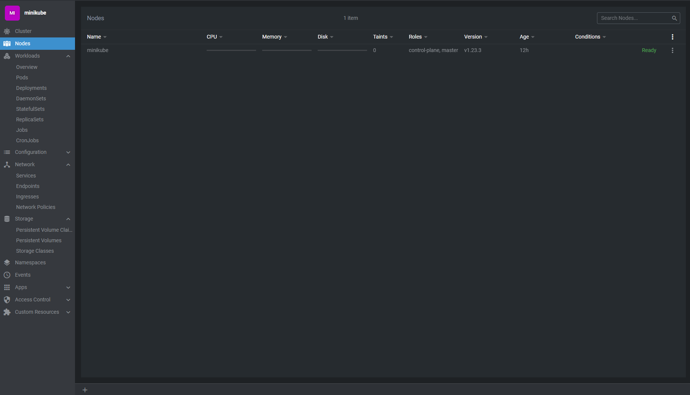

* docker build - < Jenkins_Dockerfile -t umidrahimov/customjenkins
* docker login -u {YOUR_USERNAME} -p {YOUR_PASSWORD}
* docker push umidrahimov/customjenkins

kubectl apply -f jenkins.yaml
kubectl apply -f mysql-pv.yaml
kubectl apply -f mysql.yaml

Install lens: https://api.k8slens.dev/binaries/Lens%20Setup%205.4.4-latest.20220325.1.exe

kubectl config view --raw

Open lens, click add cluster and paste config file copies from command result.
Now we have UI for managing kubernetes cluster.

Go to service page under Network section. Click jenkins

Click to 8080 will forward port to localhost and open jenkins UI.
